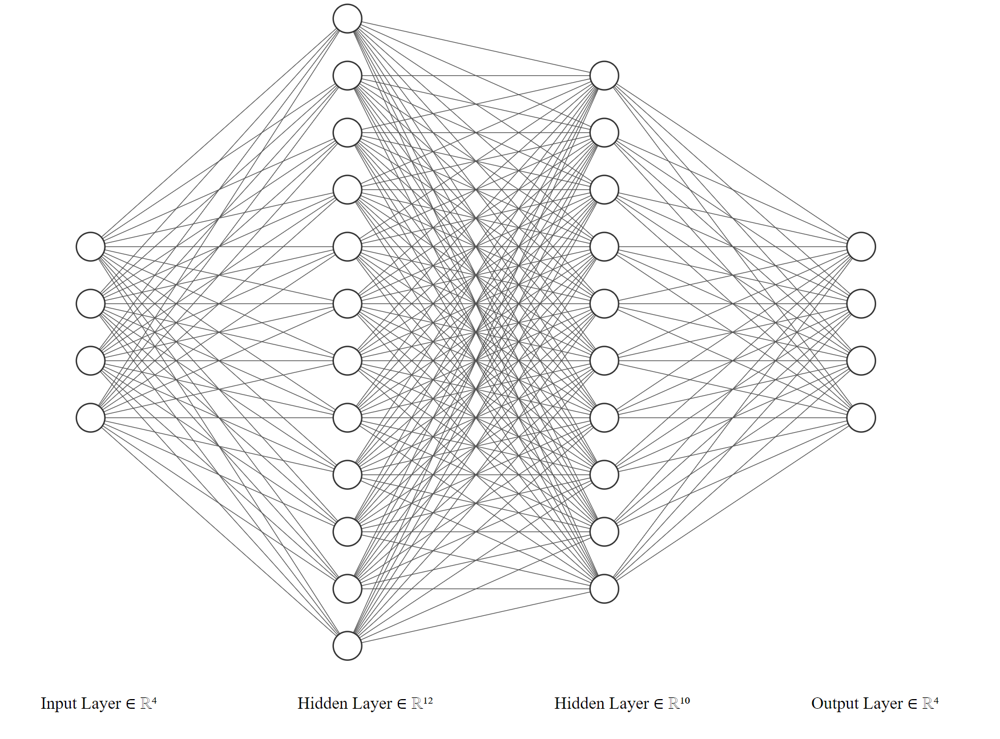

# navigation-sensor-data-classification
Classification of a Navigation Robot Sensor Dataset Using SVM, Random Forest and Neural Network

#### 1. Dataset Description
The [data](https://www.kaggle.com/datasets/uciml/wall-following-robot) used in this project, were collected as the SCITOS G5 navigated through the room following the wall in a clockwise direction, for 4 rounds. To navigate, the robot uses 24 ultrasound sensors arranged circularly around its "waist". Robot movements are considered in four classes as: Move-Forward, Slight-Right-Turn, Sharp-Right-Turn, Slight-Left-Turn

In this project, three data-set files were used, with the same class labels, but different number of features:

- The first one contains the raw values of the measurements of all 24 ultrasound sensors and the corresponding class label (Moving forward, turning left, etc). Sensor readings are sampled at a rate of 9 samples per second.
- The second one contains four sensor readings named 'simplified distances' and the corresponding class label l (Moving forward, turning left, etc). These simplified distances are referred to as the 'front distance', 'left distance', 'right distance' and 'back distance'. They consist, respectively, of the minimum sensor readings among those within 60 degree arcs located at the front, left, right and back parts of the robot.
- The third one contains only the front and left simplified distances and the corresponding class label (Moving forward, turning left, etc).

#### 2. Multi-class classification with 2 dimensional data usging SVM and Random Forest
Considering the third data set, since we only have two features (front and left simplified distances), the number of features are less than class labels. In the first step, the data is imported and devided into features and class labels. Then we have used 500 samples for the train and 100 samples for the test set. The final step in data pre-processing was to normalize the features using a min max scaler. 

Since the problem is a multi-class classification, the SVM algorithm was chosen, considering the fact that it uses hinge loss instead of square loss, and it does one-vs-rest (ovr) implicitly. In order to implement an SVM model on the data, first we have tried to find the best value for regularization parameter, using 10% of train dataset as cross validation set. The kernel type for this particular dataset could be chosen a linear kernel since it has a desirable performance. Considering the above mentioned conditions, the SVM model could be easily fitted on the train set using the corresponding function.

The random forest algorithm had also a good performance on this particular data set. This method is an ensamble algorithm which implements a large number of individual decision tress on the train dataset (boosting) and then chooses the features among these tress in a random manner (bagging). The number of trees for this project was chosen to be 1000.

In the end, the results are shown both in a scatter plot (since we have 2 dimensional data) and a confusion matrix.

#### 3. Multi-class classification with 4 dimensional data usging SVM and Random Forest
In the case we consider the second dataset, number of features would be equal to the class labels. It can be observed that our classification models have almost the same performance on this dataset as well.

#### 4. Multi-class classification with 24 dimensional data usging SVM and Random Forest
The first data set provides all 24 ultrasound sensors data, so the number of features are more than class labels. This would cause the accuracy of the SVM algorithm to be decreased. In order to compensate this, the 'rbf' kernel has also added among the grid search algorithm kernels, while the performance of random forest algorithm remains the same.

#### 5. Multi-class classification with 4 dimensional data using Neural Network
The last part, considers the implementation of an artificial neural network for the second dataset. This neural network consists of input and output layers along with two hidden layers. For the first two layers, the actiovation function is chosen to be 'relu', in order to learn the data while avoiding gradient vanishing. For the third layer, the 'softmax' activation function is chosen, since we want to predict the class label. Additionally, all the layers are considered to be dense, since we are not trying to implement filters (convolutional layers). We could have used only one hidden layer, since the data can also be classified linearly, although the accuracy would be decreased. The number of nodes in the hidden layers are chosen arbitrarily with trial and error method.

Once the model is built, we apply the gradient decent with 100 epochs, in order to implement early stopping, and in each epoch we use 128 samples of train data set. Finally, the model accuracy is tested and shown in the corresponding confusion matrix.
